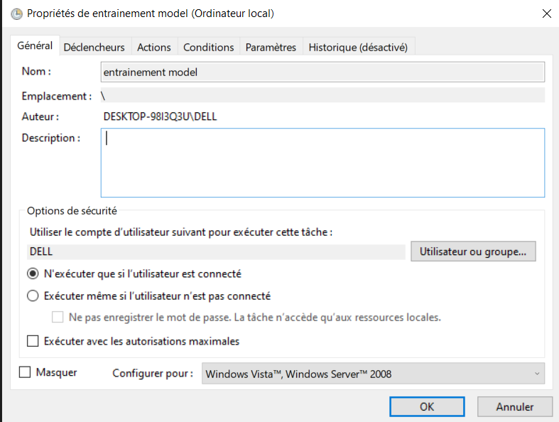
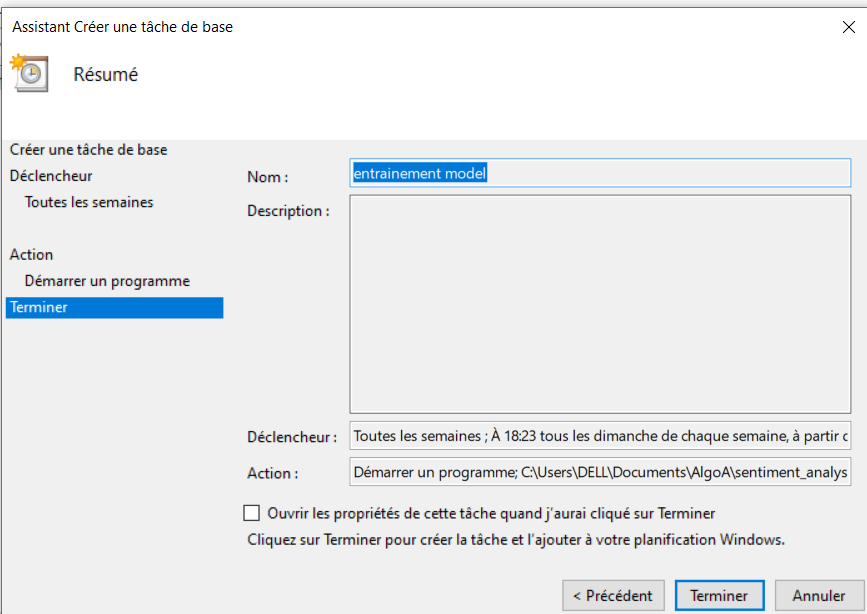

# Sentiment Analysis API

Ce dépôt contient une API de détection des sentiments basée sur une régression logistique. L'API permet d'analyser des tweets et de déterminer leur polarité (positive ou négative).

## Installation et exécution

### 1. Cloner le dépôt

```bash
git clone https://github.com/NathanielAnton/AlgoA.git
```

### 2. Lancer l'Api Flask

```bash
cd .\sentiment_analysis_api\
```

Créez un nouvel environnement virtuel :

```bash
python -m venv venv
```

Activez l'environnement virtuel avec les commandes suivantes :

Pour macOS/Linux :

```bash
.\venv\bin\activate
```

Pour Windows :

```bash
.\venv\Scripts\activate
```

Une fois l'environnement virtuel activé, installez les dépendances nécessaires en utilisant pip :

```bash
pip install -r requirements.txt
```

Dans un autre terminal, démarrez les services Docker (MySQL)

```bash
docker-compose up -d
```

Après avoir activé l'environnement virtuel et installé les dépendances, lancez votre application :

```bash
python app.py
```

### 3. Réentraîner le modèle de Machine Learning

Si vous souhaitez réentraîner le modèle avec de nouvelles données, suivez ces étapes :

Détruisez les conteneurs en cours d'exécution et redémarrez les services Docker (MySQL)

```bash
docker stop $(docker ps -q)
docker-compose up -d
```

Activer l'environnement virtuel (cf. étape 2.3)

Exécutez le script de réentraînement du modèle

```bash
python ml_model.py
```

## Note sur les tâches CRON

- Nous avons réussi à configurer et exécuter les tâches CRON en local. Cependant, comme la base de données n'est pas hébergée sur un serveur, il n'est pas possible de partager l'automatisation de ces tâches.

- Voici la marche à suivre en locale :

### Utilisation du Planificateur de tâches Windows pour lancer `ml_model.py`

1. **Ouvrir le Planificateur de tâches Windows :**

   - Appuyez sur `Win + R`, tapez `taskschd.msc` et appuyez sur `Entrée`.

2. **Créer une nouvelle tâche :**

   - Dans le volet de droite, cliquez sur **Créer une tâche**.

3. **Configurer la tâche :**

   - **Général :**
     - Nom : "Réentraînement du modèle de sentiment"
     - Exécuter avec les autorisations maximales
   - **Déclencheurs :**
     - Nouveau déclencheur : Quotidiennement à 02:00 AM
   - **Actions :**
     - Programme/script : `C:\(emplacement_relatif)\AlgoA\sentiment_analysis_api\venv\Scripts\python.exe`
     - Ajouter des arguments : `C:\(emplacement_relatif)\AlgoA\sentiment_analysis_api\ml_model.py`
   - **Conditions :**
     - Décochez "Démarrer la tâche uniquement si l'ordinateur est alimenté par le secteur"
   - **Paramètres :**
     - Cochez "Autoriser l'exécution de la tâche à la demande"

4. **Enregistrer et tester la tâche :**
   - Cliquez sur **OK** pour enregistrer la tâche.
   - Faites un clic droit sur la tâche dans la liste et sélectionnez **Exécuter** pour tester.




### Utilisation de `cron` sur macOS pour lancer `ml_model.py`

1. **Ouvrir le terminal :**

   - Appuyez sur `Cmd + Espace`, tapez `Terminal` et appuyez sur `Entrée`.

2. **Éditer la crontab :**

   - Dans le terminal, tapez la commande suivante pour éditer la crontab :
     ```sh
     crontab -e
     ```

3. **Ajouter une nouvelle tâche cron :**

   - Ajoutez une ligne à la crontab pour exécuter `ml_model.py` à une heure spécifique. Par exemple, pour exécuter le script tous les jours à 2h du matin, ajoutez la ligne suivante :
     ```sh
     0 2 * * * /Users/(emplacement_relatif)/AlgoA/sentiment_analysis_api/venv/bin/python /Users/(emplacement_relatif)/AlgoA/sentiment_analysis_api/ml_model.py
     ```
   - Remplacez les chemins par les chemins corrects vers l'exécutable Python de votre environnement virtuel et votre script `ml_model.py`.

4. **Enregistrer et quitter l'éditeur :**

   - Enregistrez les modifications et quittez l'éditeur. Si vous utilisez `nano`, appuyez sur `Ctrl + X`, puis `Y` pour confirmer les modifications, et `Entrée` pour quitter.

5. **Vérifier la crontab :**
   - Pour vérifier que la tâche cron a été ajoutée correctement, tapez la commande suivante :
     ```sh
     crontab -l
     ```
